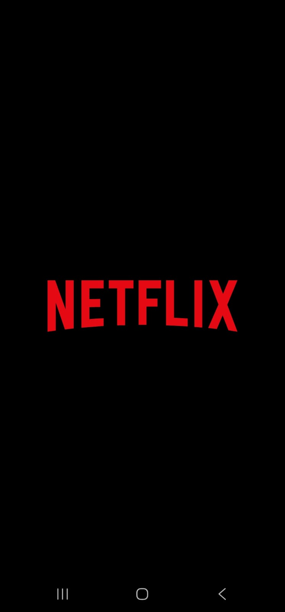
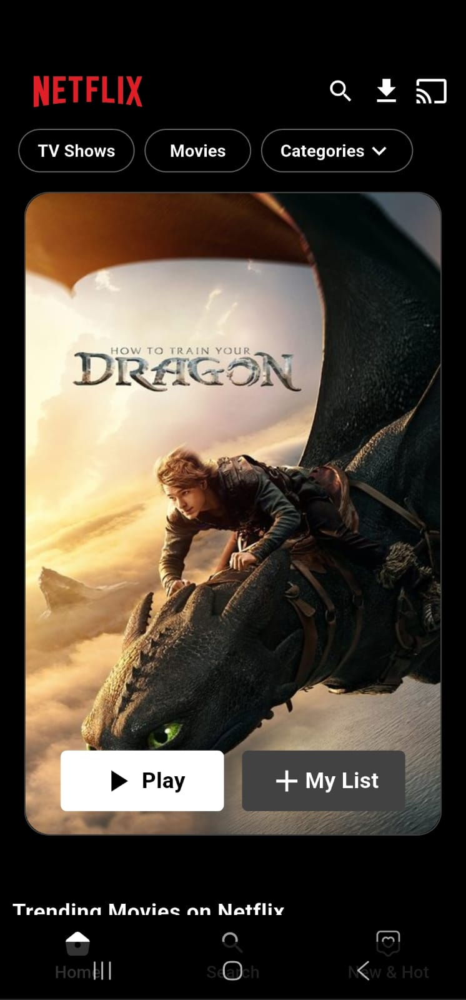
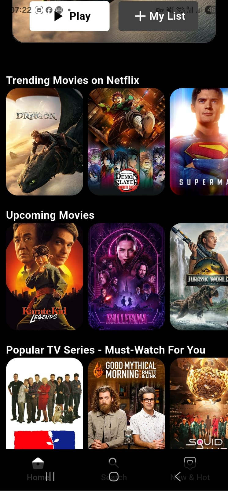
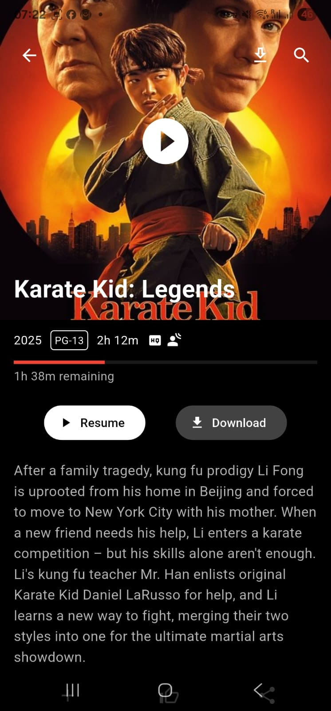
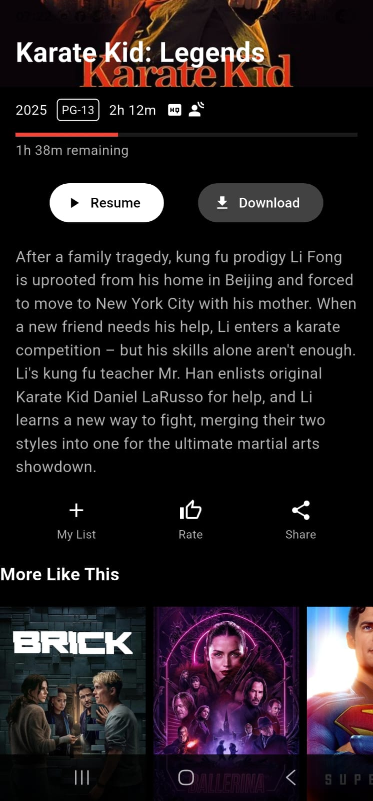
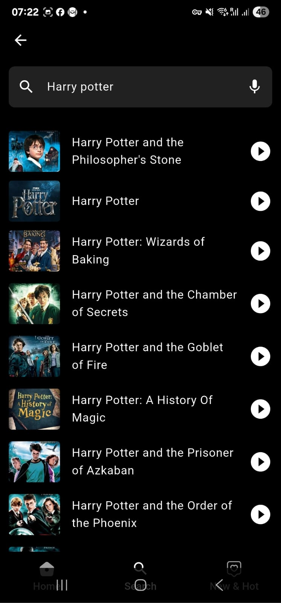
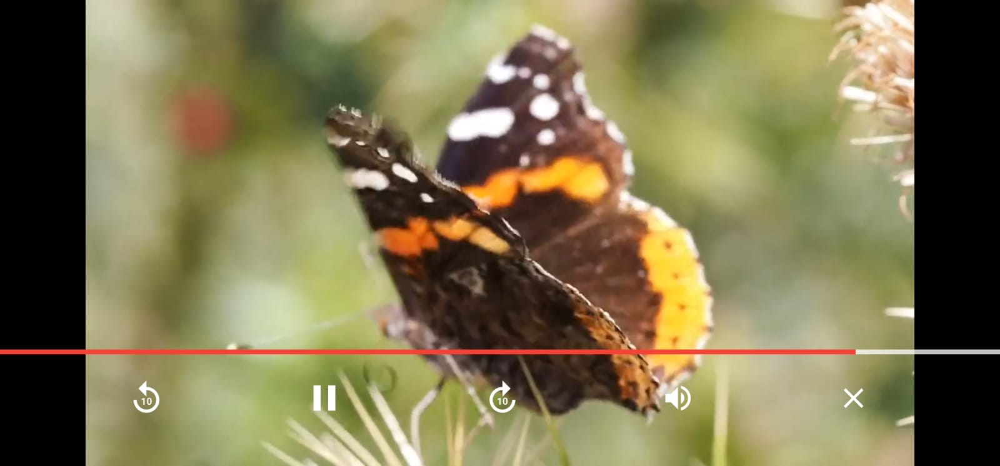

# 📺 Netflix Clone App (Flutter + TMDB API)

A beautifully crafted **Netflix-style Flutter application** that fetches real-time movie and TV show data using **The Movie Database (TMDB) API**. Users can explore trending content, top-rated movies, and TV shows, view detailed information, and experience a clean, Netflix-inspired interface.

---

## 🚀 Features

- 🔥 Explore:
  - Trending Movies & TV Series
  - Top Rated and Upcoming Movies
  - Popular TV Shows
- 🎬 Detailed Pages:
  - Movie & TV Show Overviews
  - Ratings, Genres, and Release Dates
  - Recommendations
- 🔎 Multi-type Search (Movies, TV, People)
- 📱 Clean, modern UI with responsive layouts
- ⚡ Smooth image loading with caching
- 🧭 Bottom Navigation Bar for easy navigation

---

## 📂 Project Structure

lib/
├── Common/
│ └── utils.dart
│
├── Model/
│ ├── movie_detailed.dart
│ ├── movie_model.dart
│ ├── movie_recommendations.dart
│ ├── popular_tv_series.dart
│ ├── search_multi.dart
│ ├── tmdb_trending.dart
│ ├── top_rated_movie.dart
│ ├── trending_movie_model.dart
│ ├── tv_detailed.dart
│ ├── tv_recommendations.dart
│ └── upcoming_movie_model.dart
│
├── Screen/
│ ├── app_nav_bar_screen.dart
│ ├── hot_new_screen.dart
│ ├── movie_detailed_screen.dart
│ ├── netflix_home_screen.dart
│ ├── search_screen.dart
│ ├── splash_screen.dart
│ ├── tv_detailed_screen.dart
│ └── video_screen.dart
│
├── Services/
│ └── api_services.dart
│
└── main.dart

---

## 🧰 Tech Stack

| Technology             | Description                          |
| ---------------------- | ------------------------------------ |
| **Flutter**            | UI framework for cross-platform apps |
| **Dart**               | Programming language                 |
| **TMDB API**           | Real-time movie & TV metadata        |
| **CachedNetworkImage** | Image loading and caching            |
| **Lottie**             | Splash animation                     |

---

## 🛠️ Setup & Installation

### 1. Clone the repo

```bash
git clone https://github.com/yourusername/netflix_clone_flutter.git
cd netflix_clone_flutter
flutter pub get
const String apiKey = 'YOUR_TMDB_API_KEY';
```

### You can get a free API key from -- https://www.themoviedb.org/documentation/api

```bash
flutter run
```

📸 Screenshots

<table> <tr> <td align="center"> <br/> <b>Splash Screen</b> </td> <td align="center"> <br/> <b>Home Screen</b> </td> <td align="center"> <br/> <b>Movies & TV</b> </td> </tr> <tr> <td align="center"> <br/> <b>Details</b> </td> <td align="center"> <br/> <b>More Like This</b> </td> <td align="center"> <br/> <b>Search</b> </td> </tr> <tr> <td colspan="3" align="center"> <br/> <b>Video Player</b> </td> </tr> </table>


### 1. Prepare your app for release

```bash
defaultConfig {
    ...
    minSdkVersion 21 // or higher if needed
    targetSdkVersion 34
    versionCode 1
    versionName "1.0.0"
}
```
### 2. Build release APK

```bash
flutter build apk --release
```

### 3. This will generate an optimized release APK at:

```bash
build/app/outputs/flutter-apk/app-release.apk
```

### 4. If you want to check out the mobile version -- app download the apk named app-release.apk -- you will get the app and install in your device -- CAUTION -- Might not work in IOS

## Enjoy!!!!
